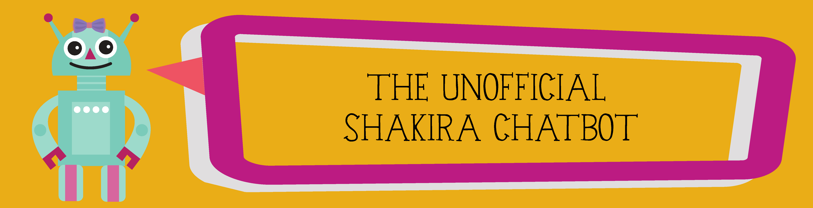
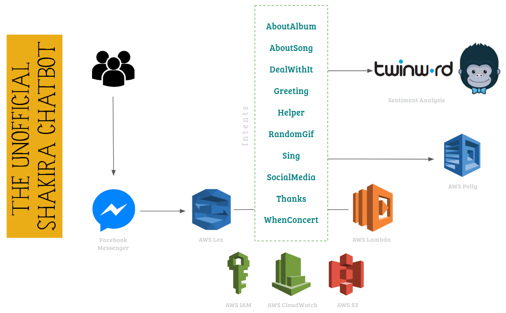

# The Unofficial Shakira Chatbot

[![Build Status][travisci-badge]][travisci-builds] 
[![Requirements Status][requiresio-badge]][requiresio-url]

## Usage

You can ask about social media, concerts (of El Dorado tour), her discography and more coming.
This bot is available in Facebook Messenger. Unfortunately it is not yet ready for public access but authorized users can chat with it [here][chatbot].

## Development considerations

* Datasources for this chatbot can be found in the [resources](resources) folder in this repository. I didn't create a database because didn't think it was _that_ interesting for this challenge.
* Custom slot types _concerts and albums_ values are generated from the datasource itself. See [lex slot builder](chatbot/lex_slot_builder.py)  
* There's a [deployment script](deploy.sh) that I use to rapidly deploy my AWS Lambda function without touching anything in AWS Lex.
* **Something really cool!** Custom slot types values are generated straight from the datasources! With this I got rid of a bunch of maintainance time for Custom Slot types, since they take care of themselves. See [here](setup.py#L218) 

## Architecture 

AWS Lex powers up this chatbot through 10 intents:

| Intent name                                           | Functionality                                                                                                                                                                                        | What's interesting?                                                                                                                                                                                                                             |
|-------------------------------------------------------|------------------------------------------------------------------------------------------------------------------------------------------------------------------------------------------------------|-------------------------------------------------------------------------------------------------------------------------------------------------------------------------------------------------------------------------------------------------|
| `Sing`                                                | Creates an audio file using [`AWS Polly`][aws-polly] on the fly, stores it in a S3 bucket. Uses `ElicitSlot` and `SessionAttributes`, reproduces the audio file in Facebook Messenger.               | On july 2017 (when this project was created), in the official Lex docs, 'voice' and 'audio' are mentioned, but there aren't any examples. I wanted to include it here just to experiment the whole generate/store/reproduce flow.               |
| `DealWithIt`                                          | This intent is created solely with the purpose of handling hate/love feelings towards the chatbot. I didn't want to create two intents for hate and love, so this one uses a sentiment analysis API. | Until developing this project, sentiment analysis felt to me like something very demanding and time-consuming to include in a project. Although, here I do it very simplistic, it wasn't such a hassle to implement.                            |
| `AboutAlbum`, `AboutSong`, `RandomGif`, `WhenConcert` | Reply based on context (slots), uses slot validations, `ElicitSlot`, `Close`.                                                                                                                        | Custom slot types values generated from the datasource itself.                                                                                                                                                                                  |
| `Greeting`, `Helper`, `SocialMedia`, `Thanks`         | These intents provide plain simple answers, necessary to fulfill some basic "human" interactions.                                                                                                    | IMHO, a chatbot should handle the most basic human interactions (hello, please, thanks) properly.                                                                                                                                               |

## Setup steps

1. Configure your AWS access key and secret key [properly][credentials]. DO NOT publish your access key and secret key to public sites such as GitHub!
2. Configure your AWS account id in an environment variable `AWS_ACCOUNT_ID`
3. Configure a `MASHAPE_API_KEY` environment variable (Necessary for the `DealWithIt` intent, this is the Twinword sentiment analysis API), you can get one [here][mashable-twinword-api-key] 
   _(If you want to skip this step you can just comment the lines that rely on Twinword API, but the `DealWithIt` intent won't work)_ 
4. Create [a virtual env][virtualenv] for the bot. 
5. Run: `source bin/activate`
6. Run: `pip install -r requirements.txt`
7. Run: `python setup.py`
8. Go to AWS Lex console, and deploy the bot in a Facebook Messenger channel following [these instructions][facebook-deploy].
9. Enjoy!

## Notes and known issues

* This bot was created from a sample bot version given for the [GOTO Amazon Chatbot Challenge.][hackathon-main]
* Somewhere, I have a problem with encoding from Lex to Lambda (Not the other way around) since many of the songs have spanish accents. That really is the very next thing.
* I should find a way to receive cities in a friendlier way. Fow now, people should type for example, New York, not NYC.
* Give this bot such a personality and fluency while adding more functionalities that even Shakira herself would like to chat with it!
* AWS Lex is a 'new' service, this chatbot brought a lot of insights, I have made a [blog post][blog-post] about it if you want to take a look :) 

[aws-polly]: https://aws.amazon.com/polly
[blog-post]: https://medium.com/@lorena.salamanca/aws-lex-insights-after-building-my-shakira-chatbot-663f71967902
[chatbot]: https://www.messenger.com/t/484930695187800
[credentials]: http://docs.aws.amazon.com/cli/latest/userguide/cli-chap-getting-started.html
[facebook-deploy]: http://docs.aws.amazon.com/lex/latest/dg/fb-bot-association.html
[hackathon-main]: http://www.amazondcn.com/challenge/index.html
[mashable-twinword-api-key]: https://market.mashape.com/twinword/sentiment-analysis-free
[requiresio-badge]: https://requires.io/github/imTachu/ShakiraChatbot/requirements.svg?branch=master
[requiresio-url]: https://requires.io/github/imTachu/ShakiraChatbot/requirements/?branch=master
[travisci-badge]: https://travis-ci.org/imTachu/ShakiraChatbot.svg?branch=master
[travisci-builds]: https://travis-ci.org/imTachu/ShakiraChatbot's
[virtualenv]: http://python-guide-pt-br.readthedocs.io/en/latest/dev/virtualenvs/

